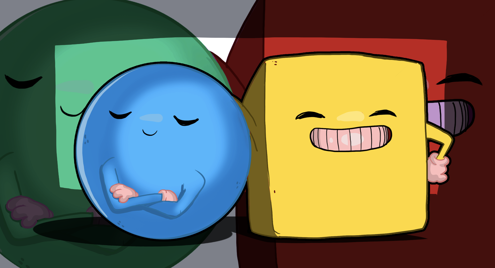
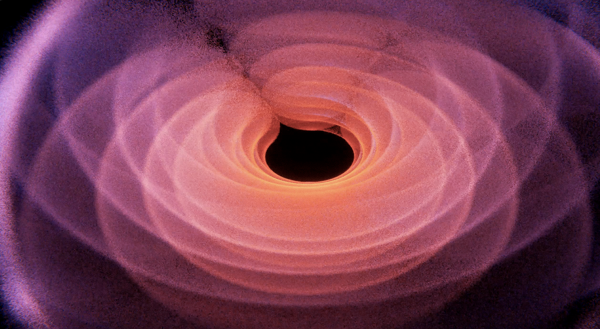
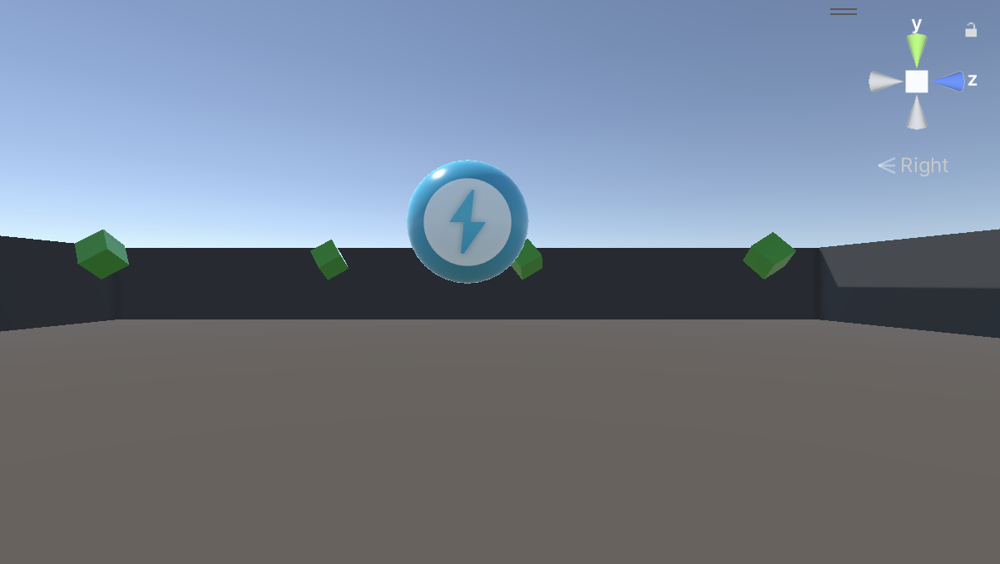
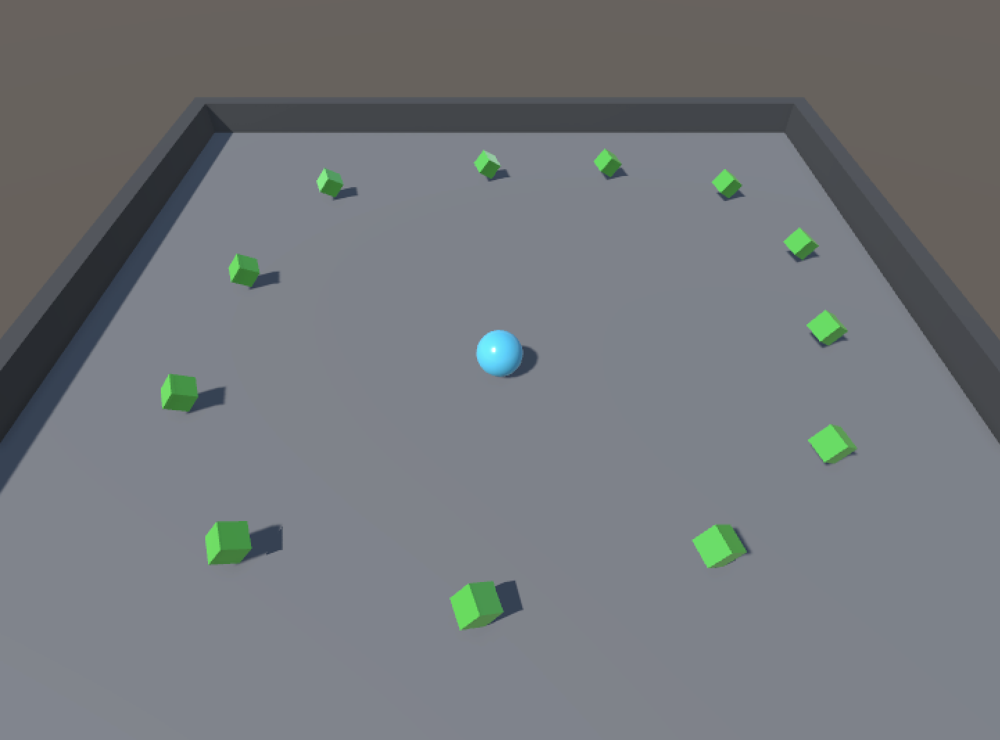
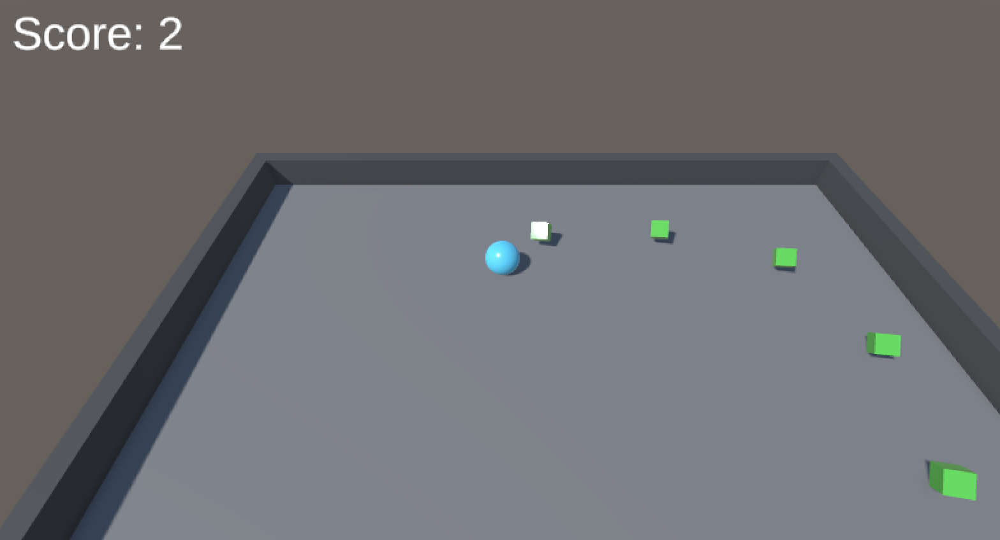

# Roll A Ball

<html>

</html>

The creation of this game is based on understanding the basics of Unity; how to navigate the editor, create Scripts in C#, set up input using the new Input System, and create a basic user interface. [Roll-a-Ball](https://learn.unity.com/project/roll-a-ball)

<html>

</html>

> _Powered by Unity_

## Technologies Used

* _Github_
* _VSCode_
* _C#_
* _Unity_
* _.NET_
* _JSON_

<html>

</html>

<html>

</html>

<html>

</html>

> Current game state as of _10/28/2023_

### Gameplay

**Player Controls**: The Player GameObject responds to player input by applying force. Physics interactions work as expected.

**Speed**: The Player's speed is currently optimal.

**Responsive Walls**: All walls in the game world are responsive to collisions, allowing for dynamic interactions as the Player navigates the play area.

**Risk of Falling**: Player can fall off the play area if they roll the ball towards a wall at full speed.

**PickUp Rotation**: PickUp GameObjects rotate smoothly.

### Work in Progress

* Custom play area (maze-like)

* Obstacle challenges

* Physics experimentation
